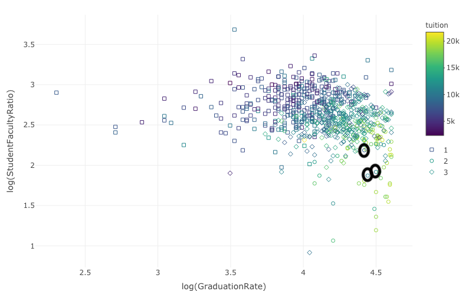

```{r setup, include=FALSE}
knitr::opts_chunk$set(echo = FALSE, warning = FALSE, message = FALSE)
```

```{r}
library(tidyverse)  # load libraries 
library(caret)
library(class)
library(plotly)
library(RColorBrewer)
library(ROCR)
library(MLmetrics)
library(ggpubr)
library(e1071)  
library(plotly)
library(htmltools)
library(devtools)
library(NbClust)
library(DT)
```

## Question and Background Information 
One of the biggest choices a student will make in their academic career is where they attend college.  While there are many factors that go into making a college experience enjoyable or successful, one commonly used method of evaluating universities as a whole is "best value." According to U.S. News, best value schools are those that are "above average academically and cost considerably less than many other schools" (https://www.usnews.com/education/best-colleges/articles/best-value-schools-faq).  There are many resources that will rank universities based on their quality of program and cost of attendance.  For example, the U.S. News reports Yale University, Massachusetts Institute of Technology, and Harvard University as the top 3 best value schools as of this year (https://www.usnews.com/best-colleges/rankings/national-universities/best-value).  While short descriptions are given as to why these schools are ranked so highly, the raw data and methodology is not readily available.  Therefore, we will be using the data set "US College Data" in order to directly evaluate what universities are of the best value based on different metrics such as graduation rates, student to faculty ratios, and out-of-state tuition (https://www.kaggle.com/yashgpt/us-college-data).  
Our overall question is: Which university is the "best value?"

## Exploratory Data Analysis 
### Read and Clean the Data 
```{r}
data<- read.csv("/Users/mj/Desktop/2021 Fall/DS 3001/DS-3001/Final Project/College_Data.csv")  # reading in the data set 

data <- data %>% rename(College = X, AppsRecieved = Apps, AppsAccepted = Accept, NewStudentsEnrolled = Enroll, Top10Percent = Top10perc, Top25Percent = Top25perc, FullTimeUndergrads = F.Undergrad, PartTimeUndergrads = P.Undergrad, OutStateTuition = Outstate, RoomBoardCosts = Room.Board, BooksCost = Books, PersonalSpendings = Personal, FacultyPhDPercentage = PhD, FacultyTerminalPercentage = Terminal, StudentFacultyRatio = S.F.Ratio, DonatingAlumniPercentage = perc.alumni, ExpenditurePerStudent = Expend, GraduationRate = Grad.Rate)  # relabel the columns with more understandable names

data$Private <- as.factor(data$Private)

data$Private<-as.factor(ifelse(data$Private == "Yes",1,0))  # make private vs public school a factor variable

data <- data[complete.cases(data), ]  # remove missing data rows

data[which(data$GraduationRate > 100), "GraduationRate"] <- 100  # change graduation rates over 100 to 100

str(data)
```

### Numeric Variable Correlations with Tuition

```{r}
numeric <- names(select_if(data, is.numeric))  # select the numeric column labels
numericdata <- data[,numeric]  # create a table of the numeric data columns
tuition<- numericdata[,8]  # save tuition as its own vector 
numericvars <- numericdata[,-8]  # save other numeric variables in table

cors = data.frame(CorrelationWithTuition = apply(numericvars, 2, function(x) cor(tuition, x)))  # apply the correlation function to the tuition vector and all columns of the numeric variable table to determine which variables are most correlated to tuition
cors <- arrange(cors, -abs(CorrelationWithTuition))
datatable(cors)
```

The variables with the greatest correlation to tuition are those that will be the most informative of varying university quality based on price.  Therefore, the highly correlated variables will be best to cluster the data and determine which universities are the best value. The variables with strong correlations above 0.5, or below -0.5 are University Expenditure Per Student, Room and Board Costs, Graduation Rate, the Percentage of Alumni who Donate, the Percentage of Students in the Top 10% of their Class, and the Student to Faculty Ratio.  

Noting, however, that room and board is another cost to the student rather than an offering of the university similar to tuition, this metric will only be used in clustering, but will not be used in modeled when determining value,.  Therefore, the variables we will use to model the value of universities are Expenditure Per Student, Graduation Rate, the Percentage of Alumni who Donate, the Percentage of Students in the Top 10% of their Class, and the Student to Faculty Ratio.

### Highly Correlated Variable Plots with Tuition
```{r}
# plot the variables with tuition to visualize direction and strengths of correlations
scatter1<-ggplot(data=data, mapping= aes(tuition,ExpenditurePerStudent)) + geom_point()+ ggtitle("Expenditure Per Student") + theme(axis.title.x = element_text(size = 8), axis.title.y = element_text(size = 9),plot.title = element_text(size = 10))

scatter2<-ggplot(data=data, mapping= aes(tuition,GraduationRate)) + geom_point()+ ggtitle("Graduation Rate")+ theme(axis.title.x = element_text(size = 8), axis.title.y = element_text(size = 9),plot.title = element_text(size = 10))

scatter3<-ggplot(data=data, mapping= aes(tuition,DonatingAlumniPercentage)) + geom_point()+ ggtitle("Percent of Alumni who Donate") + theme(axis.title.x = element_text(size = 8), axis.title.y = element_text(size = 9),plot.title = element_text(size = 10))

scatter4<-ggplot(data=data, mapping= aes(tuition,Top10Percent)) + geom_point()+ ggtitle("Student Percent in Top 10%") + theme(axis.title.x = element_text(size = 8), axis.title.y = element_text(size = 9),plot.title = element_text(size = 10))

scatter5<-ggplot(data=data, mapping= aes(tuition,StudentFacultyRatio)) + geom_point()+ ggtitle("Student to Faculty Ratio") + theme(axis.title.x = element_text(size = 8), axis.title.y = element_text(size = 9),plot.title = element_text(size = 10))

figure <- ggarrange(scatter1, scatter2, scatter3, scatter4, scatter5,
                    ncol = 3, nrow = 2)
figure
```

Overall, we see the strongest correlation with Expenditure Per Student as this data most tightly fits a linear trend with tuition.  Other notable trends are that all of the variables except student to faculty ratio have a direct correlation with tuition suggesting that as tuition increases, so does expenditure per student, graduation rate, percentage of donating alumni, and percentage of students in the top 10% of their class.  On the other hand, the student to faculty ratio decreases as tuition increases. Therefore, when looking for best value universities, we will be looking for schools with higher expenditures per student, graduation rates, percentages of donating alumni, and percentages of students in the top 10% of their class, and lower student to faculty ratios.  

## Methods 
In order to determine the patterns that exist among university attributes, we will use a k-means clustering algorithm.  K-means is an unsupervised algorithm in which clustering of data occurs by minimizing the variance, or distance, between intra-cluster data and maximizing the variance between inter-cluster data points.  With the k-means clustering algorithm, we will cluster universities into those that are of higher or lower quality.  Then, we will examine university tuitions to determine which universities are the "best value," with high quality and low tuition.

### Standardizing The Numeric Variables 
To ensure that our algorithm runs correctly with fair consideration of each variable, we will standardize the numeric university attributes so that they are all scaled equally.  
```{r}
corvars<- c("ExpenditurePerStudent", "RoomBoardCosts", "GraduationRate", "DonatingAlumniPercentage", "Top10Percent", "StudentFacultyRatio")
corvars <- numericvars[,corvars] 
standardized <- scale(corvars)  # scale standardizes the variables so that they are centered around 0 and vary by a standard deviation of 1 
datatable(standardized) # output the table
```

### Determining How Many Clusters to Use {.tabset}
Both the elbow plot and NbClust method indicate the 3 clusters is a good choice for the data.  The elbow plot "kinks" to indicate diminishing returns around k=3 and 8 of the k-means algorithms chose 3 clusters most often.  Although, 9 of the k-means algorithms chose 2 clusters most often, the increased explained variability in the elbow plot appears significant enough to use 3 clusters instead of 2.  Therefore, we will make our model with 3 clusters.  

#### Elbow Plot

```{r}
# explained variance function will take data and a specific number of clusters and output the corresponding variance explained
explained_variance = function(data_in, k){   
  
  set.seed(1)  # set seed for reproducibility
  kmeans_obj = kmeans(data_in, centers = k, algorithm = "Lloyd", iter.max = 30) # Running the k-means algorithm with euclidean distance
  
  # Calculate the variance accounted for by clusters:
  # var_exp = intercluster variance / total variance
  var_exp = kmeans_obj$betweenss / kmeans_obj$totss
  var_exp  
}

explained_var_list = sapply(1:20, explained_variance, data_in = standardized)  # run the explained_variance function with the numeric variable data and cluster numbers 1 through 20

elbow_data = data.frame(k = 1:20, Explained_Variance= explained_var_list)  # put explained_variance output in data frame with corresponding k value to use for plotting

#Create a elbow chart of the output of the explained_variance function run
ggplot(elbow_data,   # create a ggplot using the elbow chart data
       aes(x = k,  # use k on the x axis and explained variance on the y axis
           y = Explained_Variance)) + 
  geom_point(size = 4) +           # set the size of the data points
  geom_line(size = 1) +            # set the thickness of the line
  ggtitle('Variance Explained by Different Cluster Numbers') +  # title the graph
  xlab('k') +   # label the x and y axes
  ylab('Inter-cluster Variance / Total Variance') + 
  theme_bw()  # use the ggplot theme black and white to display

```

The Elbow Plot graphs the explained variance of the model with different cluster numbers.  When the graph begins to plateau, this indicates that the increasing complexity is providing decreasing information, a phenomena called diminishing returns.  Therefore, we want a cluster number that provides the most explained variance before diminishing returns begin.  

#### NBClust: K by Majority Vote 

```{r}
set.seed(1)  # set starting point for reproducibility
nbclust_obj = NbClust(data = standardized, method = "kmeans")  # Use the NBClust method to run many approaches of k-means and output the most frequent cluster number chosen by each approach

freq_k = nbclust_obj$Best.nc[1,]  # subset the first row of the best.nc output which states the k chosen by each approach
freq_k = data.frame(Number_of_Clusters_Recommended = freq_k)  # convert row to a data frame so that it can be plotted by ggplot

# Plot the frequency of clusters selected by methods
ggplot(freq_k,   # creates a plot using the frequency data fame
       aes(x = Number_of_Clusters_Recommended)) +  # plots the recommended clusters on the x axis
  geom_bar() +  # makes a bar chart
  scale_x_continuous(breaks = seq(0, 15, by = 1)) +  # sets the x and y axis ticks
  scale_y_continuous(breaks = seq(0, 15, by = 1)) +
  labs(x = "Number of Clusters",  # labels the title of the plot and the axes
       y = "Number of Votes",
       title = "NBClust Cluster Analysis") + 
  theme_bw()  # use the ggplot theme black and white to display
```

The NBClust method runs a variety of approaches to the k-means clustering algorithm and returns the number of clusters that each approach chose most often to evaluate the data.  The plot above summarizes the number of approaches that chose each cluster number most often.  This method of determining cluster number is through majority vote.  

### Run K-Means Algorithm using 3 Clusters
From our 3 cluster model, it appears that the first cluster (Cluster 1) is likely the poorer quality schools with the smallest expenditure per student, graduation rate, donating alumni percentages, and percentage students in the Top 10% of their classes, and biggest student to faculty ratio. The second cluster (Cluster 2) is likely higher quality schools with the largest expenditure per student, graduation rate, donating alumni percentages, and percentage students in the Top 10% of their classes, and smallest student to faculty ratio. Finally the third cluster (Cluster 3) is more mid-range universities.

```{r}
set.seed(1)  # sets the starting point for R to run the algorithm so that the results are reproducible
kmeans_obj = kmeans(standardized, centers = 3, # implements the k-means method with 3 centroids 
                        algorithm = "Lloyd")   # using the euchlidean distance method

# kmeans_obj  # prints the result of the k-means algorithm 

kmeans_obj # prints the results of each output from the k-means algorithm
```

### Modeling and Results of Clusters {.tabset}
#### Graduation Rate vs Students in the Top 10% of Class

```{r}
clusters = as.factor(kmeans_obj$cluster)  # converts the cluster variable to factor rather than numeric so that when graphing they can be used as categories

plotting <- data.frame(corvars, tuition, clusters)  # combine the numeric variables and the tuition data into a data frame 

plotting <- data.frame(plotting, College = data$College)  # combine the data with college names

fig1 <- plot_ly(plotting, # create a plotly graphic
               type = "scatter",  # make it a scatterplot 
               mode="markers",
               symbol = ~clusters,  # make the point shape based on the cluster column
               x = ~GraduationRate, # make x axis grad rate column
               y = ~Top10Percent, # make y axis top 10% column
               color = ~tuition,  # color the points based on the tuition column
               symbols = c(0,1,5),  # make the symbols, open circle, square, and triangle
               text = ~paste('College:',College,  # hover text for college and tuition
                             "Tuition:",tuition))


fig1 
```

The two universities that stand out with relatively high graduation rates and percentages of students in the top 10% of their class, with low tuitions around 10k or less are Georgia Tech and UNC at Chapel Hill. Both of these schools also fall within Cluster 2, which we identified as the cluster containing higher quality schools.

Below, see the highlighted points for Georgia Tech and UNC at Chapel Hill.
 

#### Expenditure Per Student vs Student to Faculty Ratio

```{r}
fig2 <- plot_ly(plotting, # create a plotly graphic
               type = "scatter",  # make it a scatterplot 
               mode="markers",
               symbol = ~clusters,  # make the point shape based on the cluster column
               x = ~log(ExpenditurePerStudent), # set x and y axis data
               y = ~log(StudentFacultyRatio), 
               color = ~tuition,  # color the points based on the tuition column
               symbols = c(0,1,5),  # make the symbols, open circle, square, and triangle
               text = ~paste('College:',College,  # hover text for college and tuition
                             "Tuition:",tuition))


fig2 
```

The two universities that stand out with relatively high expenditures per student and low student to faculty ratios, with low tuitions around 10k or less are Creighton University and UNC at Chapel Hill. Saint Louis University also stands out as having an even lower student to faculty ratio than both Creighton and UNC and higher expenditures per student than UNC, but the tuition is a bit higher, ~11.5k. That being said, it is rather subjective for where we decide to draw the line of evaluating a tuition as low or not.

Below, see the highlighted points for Creighton University and UNC at Chapel Hill.


#### Graduation Rate vs Donating Alumni Percentage
```{r}
fig3 <- plot_ly(plotting, # create a plotly graphic
               type = "scatter",  # make it a scatterplot 
               mode="markers",
               symbol = ~clusters,  # make the point shape based on the cluster column
               x = ~GraduationRate, #  set x and y axis data
               y = ~DonatingAlumniPercentage, 
               color = ~tuition,  # color the points based on the tuition column
               symbols = c(0,1,5),  # make the symbols, open circle, square, and triangle
               text = ~paste('College:',College,  # hover text for college and tuition
                             "Tuition:",tuition))


fig3 
```

The only university which stands out with a high graduation rate (>80%) and a high percentage of alumni who donate (> or =50%)is Mary Baldwin College.  This is likely because the metric "DonatingAlumniPercentage" will be high for smaller private schools which require private funding. 

Below, see the highlighted point for Mary Baldwin College.


#### Graduation Rate vs. Student to Faculty Ratio
```{r}
fig4 <- plot_ly(plotting, # create a plotly graphic
               type = "scatter",  # make it a scatterplot 
               mode="markers",
               symbol = ~clusters,  # make the point shape based on the cluster column
               x = ~log(GraduationRate),  # set x and y axis data
               y = ~log(StudentFacultyRatio), 
               color = ~tuition,  # color the points based on the tuition column
               symbols = c(0,1,5),  # make the symbols, open circle, square, and triangle
               text = ~paste('College:',College,  # hover text for college and tuition
                             "Tuition:",tuition))


fig4 
```
The three universities which stand out as having a high graduation at a low student to faculty ratio while still maintaining a tuition that is around 11k or less are Creighton University, Mary Baldwin College, and University of North Carolina at Chapel Hill. Accordingly, all three of these schools are in Cluster 2.

Below, see the highlighted points for Creighton University, Mary Baldwin College, and University of North Carolina at Chapel Hill.


## Evaluation

### Variance Explained
The total variance explained by the model with 3 clusters is 0.451. The variance explained is a measure of how much of the overall variance within the data is accounted for by the clusters by dividing the inter-cluster variance by the total variance, both intra and inter-variance.  Therefore, a value closer to 1 indicates clusters that are more tightly packed and further apart from each other while a value closer to 0 indicates clusters that are less packed and distinctive.  The value of 0.451 indicates that there is variance in the data that our model does not account for, and that our model could benefit from additional variables in the clustering process.  However, given that the explained variance is not extremely close to 1, this indicates that the clustering algorithm is worth pursuing as the clusters are not easily identifiable, and our model does have an added benefit to classifying universities as poor, average, and high quality.  

The Inter-Cluster Variance is: 
```{r}
# Evaluate the quality of the clustering
# Inter-cluster variance
(num_data = kmeans_obj$betweenss)

```

The Total Variance is: 
```{r}
# Total variance
(denom_data = kmeans_obj$totss)
```

Therefore, the Variance Explained by our model is: 
```{r}
# Variance accounted for by clusters.
(var_exp = num_data / denom_data)
```

### Visual Evaluation
In order to visualize the benefits of our clustering model, we are looking for distinct groupings of universities in clusters 1, 2, and 3. In our graphics, the grouping of clusters is indicated by the groupings of square (cluster 1), circle (cluster 2), and diamond (cluster 3) point markers. In each graphic, the cluster 2 observations are at the "front" of the data, with more favorable values, cluster 1 observations are in the middle of the data, with average values, and cluster 3 observations are at the "back" of the data, with poorer values.  While there is overlap between the clusters, there is an overall distinct region for each of the cluster types, therefore suggesting that the clustering algorithm is effective.  For example, these cluster regions can be observed in the below graph of the Percentage of Alumni who Donate and the Graduation Rate.  

```{r}
fig3
```


## Fairness Assessment 
Our data set does not include any protected classes. It is very likely that, because each observation is representing a different college or university, there exists data on protected classes but it has already been omitted from our dataset. For example, colleges have diversity statistics such as the breakdown of students by race/ethnicity as well as gender. 
While this certainly makes our analysis process straightforward, we need to be cautious because it is possible that a protected class is inherently built into the features that we have used in our model. Essentially, a feature in our dataset such as personal spending could already be impacted by a protected class. However, because the dataset does not include any protected classes, we have no way of knowing whether there is any correlation between the features and a protected class. 
Nevertheless, in our case while it is important to keep these cautions in mind, we do not think that there is any reason for extreme concern about the potential for protected classes. 

## Conclusions 
Overall, the University of North Carolina at Chapel Hill appears to be university that stands out among the rest as high quality and low cost.  UNC at Chapel Hill has a graduation rate of 83% and a percentage of students coming from the top 10% of their class at 75% which indicates the high academic standing of its student body.  Further, the school focuses many resources on each of its students with an expenditure on each student of around $16,000 and a low student to faculty ratio of roughly 9 to 1.   While its percentage of donating alumni is only 23%, this is likely because it is a public school and thus has state funding, as opposed to smaller private schools which rely more heavily on alumni donations.  Finally, UNC at Chapel Hill has a tuition of \$8,400 per semester which is lower than many of the other universities in this high quality cluster.  


## Future Work 
In future work, there are some additions to the data that could be useful.  First, the data set only contains information for 777 universities in the United States.  Given that there are roughly 4,000 degree granting universities in the US according to the US Department of Education, this data set could be expanded greatly to both better our clustering algorithm with more information and introduce other best value schools which may have not been considered (https://www.usnews.com/education/best-colleges/articles/how-many-universities-are-in-the-us-and-why-that-number-is-changing).  Second, the data set only records out-of-state tuition so when looking for low cost schools, only the base rate out-of-state tuition is considered. Given that public schools offer an in-state cost and different schools may offer varying amounts of aid packages, this could alter our evaluation of low cost schools.  Particularly on an individual basis, certain schools might be low-cost to some students, due to state of residency or financial aid received, while high-cost to other students.  Finally, this data was collected in 2019 so it is outdated for the current 2021 year.  Specifically with tuition cost increasing significantly each year, the tuition variable needs to be updated in order for the analysis to be applicable for today's students.  


